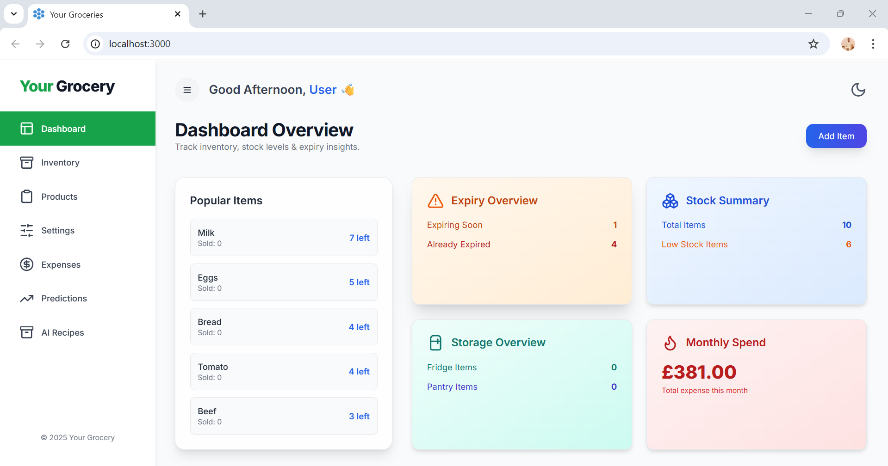
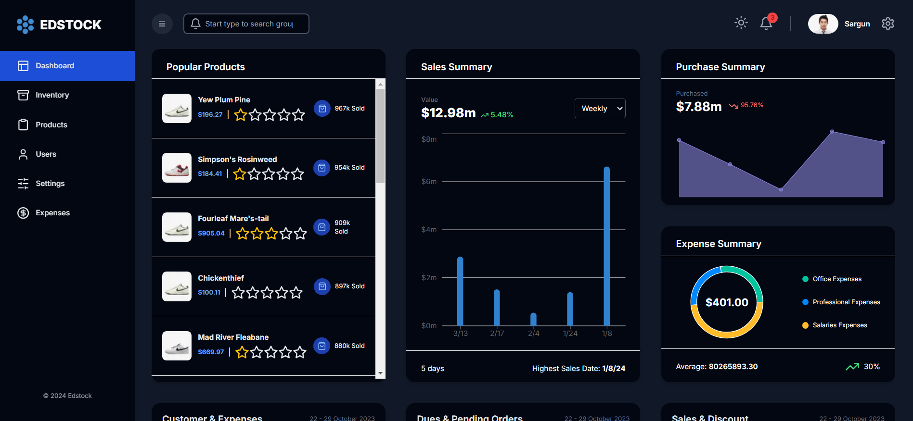
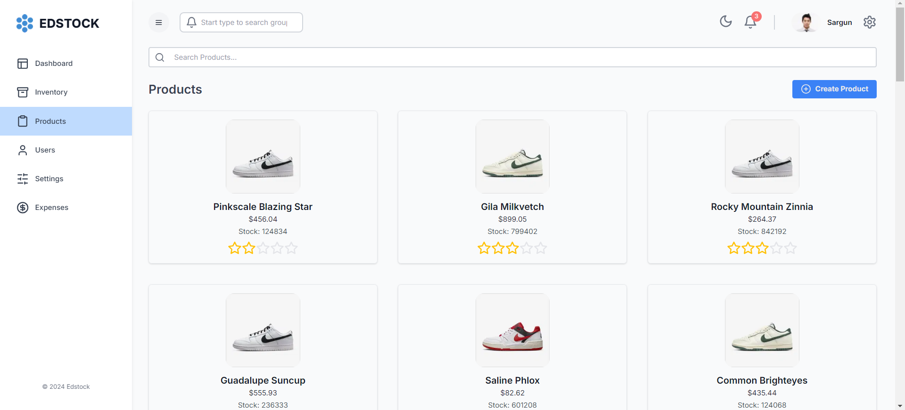
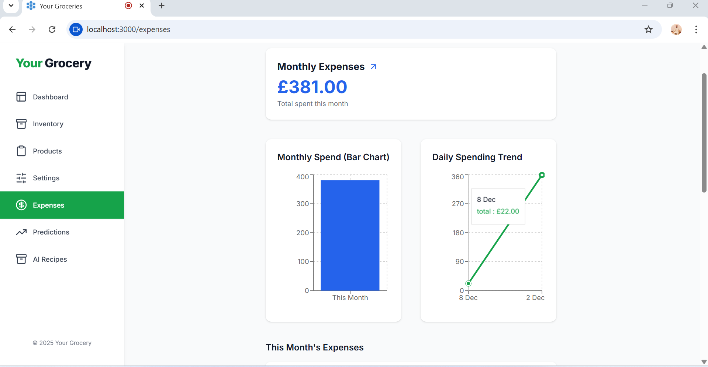

# Edstock - Inventory Management System

Welcome to **Edstock**, a robust and scalable inventory management system designed to streamline the process of managing and tracking inventory. This full-stack application leverages modern web technologies to deliver a seamless user experience and powerful backend capabilities.

## 🌟 Features

- **Real-time Inventory Tracking:** Monitor stock levels in real-time with instant updates.
- **Responsive Design:** Fully responsive UI built with **Next.js** and **Tailwind CSS**, ensuring a smooth experience on any device.
- **Data Management:** Efficiently manage large datasets with **Material UI Data Grid**.
- **State Management:** Utilize **Redux Toolkit** and **Redux Toolkit Query** for managing global state and API requests.
- **Secure and Scalable Backend:** Built with **Express.js** and deployed on **AWS EC2** for reliable performance.
- **Cloud-based Storage:** Secure data storage using **AWS RDS** and **AWS S3**.
- **API Management:** **AWS API Gateway** is used to handle and route API requests effectively.

## 🚀 Tech Stack

- **Frontend:** Next.js, Tailwind CSS, Material UI Data Grid
- **Backend:** Node.js, Express.js, Prisma
- **State Management:** Redux Toolkit, Redux Toolkit Query
- **Database:** AWS RDS (PostgreSQL)
- **Cloud Services:** AWS EC2, AWS Amplify, AWS S3, AWS API Gateway

## 📷 Images

Here are some screenshots of the Edstock application:








*Managing inventory with detailed product information and stock levels.*


## 📦 Installation

1. **Clone the repository:**

    ```bash
    git clone https://github.com/SargunSinghSethi/Edstock.git
    cd edstock
    ```

2. **Install dependencies in both client and server directory:**

    ```bash
    cd client
    npm install
    cd ../server
    npm install
    ```

3. **Set up environment variables:**

    Create a `.env.local` file in the client directory and add your backend api connection details:

    ```bash
    DATABASE_URL=your_database_url
    NEXT_PUBLIC_API_BASE_URL=your_backend_url
    ```
    
    Create a `.env` file in the server directory and add your port address and database connection details:

    ```bash
    PORT=8000
    DATABASE_URL=your_database_url
    ```

4. **Run the development server for the fontend:**

    ```bash
    npm run dev
    ```

    The app will be available at [http://localhost:3000](http://localhost:3000).
   
4. **Run the development server for the backend:**

    ```bash
    npm run dev
    ```

    The app will be available at [http://localhost:8000](http://localhost:8000).

## 🛠️ Usage

- **Frontend:** The frontend is built with Next.js and is hosted on AWS Amplify. It provides a responsive and intuitive user interface for managing inventory.
- **Backend:** The backend is built with Express.js and Prisma, and is deployed on AWS EC2. It handles data processing and serves API requests.
- **Database:** Data is stored securely using AWS RDS (PostgreSQL), ensuring scalability and reliability.
- **File Storage:** Images and other files are stored in AWS S3, providing durable and scalable storage.

## 🧑‍💻 Contributing

Contributions are welcome! If you have any ideas, suggestions, or issues, feel free to open an issue or submit a pull request.

1. Fork the repository.
2. Create a new branch (`git checkout -b feature-branch`).
3. Make your changes.
4. Commit your changes (`git commit -m 'Add some feature'`).
5. Push to the branch (`git push origin feature-branch`).
6. Open a pull request.
